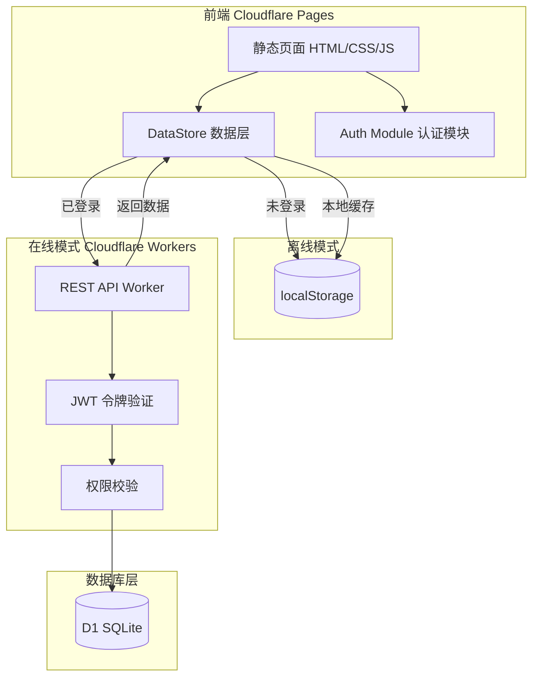

# MakeX Inspire 成绩统计系统 — 架构演进计划

> 非登录状态采用 localStorage，登录后依据权限进行云端管理

---

## 一、总体架构



### 核心原则

1. **localStorage 始终作为本地缓存** — 无论是否登录都保留一份完整数据副本
2. **未登录时完全本地读写** — 与当前行为一致，零网络依赖
3. **登录后读写走 API** — 同时更新 localStorage 作为离线备用
4. **增量同步** — 减少数据传输量，支持弱网环境

---

## 二、数据层改造 — DataStore

当前 `Shared` 对象升级为支持双模存储的 `DataStore`，所有页面通过统一接口访问数据。

### 核心接口

| 方法                          | 说明                                         |
| ----------------------------- | -------------------------------------------- |
| `init()`                    | 初始化，检测登录状态，加载本地数据           |
| `getData(key)`              | 读取数据（内存 → localStorage）             |
| `setData(key, value)`       | 写入数据（内存 + localStorage + 在线时推送） |
| `login(username, password)` | 登录，获取 JWT，拉取云端数据合并             |
| `logout()`                  | 登出，清除令牌，回退 localStorage            |
| `pullFromServer()`          | 全量拉取云端数据 → 合并到 localStorage      |
| `pushToServer()`            | 将本地变更推送到云端                         |
| `sync()`                    | 自动同步（增量）                             |
| `can(permission)`           | 权限检查                                     |

### 数据流

```
App 组件
  │
  ▼
DataStore.getData('students')
  │
  ├── 内存中有缓存？ → 直接返回
  │
  ├── 已登录？
  │     ├── 是 → GET /api/students → 缓存到内存+localStorage → 返回
  │     └── 否 → localStorage.getItem → 缓存到内存 → 返回
  │
DataStore.setData('students', newList)
  │
  ├── localStorage.setItem (始终写入)
  │
  └── 已登录？
        ├── 是 → POST /api/data/sync (异步推送)
        └── 否 → 仅本地
```

---

## 三、数据库表结构（Cloudflare D1 — SQLite）

```sql
-- 用户表
CREATE TABLE users (
  id TEXT PRIMARY KEY,
  username TEXT UNIQUE NOT NULL,
  password_hash TEXT NOT NULL,
  display_name TEXT NOT NULL,
  role TEXT NOT NULL CHECK(role IN ('admin','coach','student')),
  created_at TEXT DEFAULT (datetime('now'))
);

-- 班级
CREATE TABLE groups (
  id TEXT PRIMARY KEY,
  name TEXT NOT NULL,
  created_at TEXT DEFAULT (datetime('now'))
);

-- 学员
CREATE TABLE students (
  id TEXT PRIMARY KEY,
  name TEXT NOT NULL,
  group_id TEXT REFERENCES groups(id),
  created_at TEXT DEFAULT (datetime('now'))
);

-- 任务
CREATE TABLE tasks (
  id TEXT PRIMARY KEY,
  name TEXT NOT NULL,
  type TEXT NOT NULL CHECK(type IN ('basic','challenge')),
  max_score INTEGER,
  created_at TEXT DEFAULT (datetime('now'))
);

-- 集训
CREATE TABLE trainings (
  id TEXT PRIMARY KEY,
  name TEXT NOT NULL,
  date TEXT NOT NULL,
  created_at TEXT DEFAULT (datetime('now'))
);

-- 集训-学员关联
CREATE TABLE training_students (
  training_id TEXT REFERENCES trainings(id),
  student_id TEXT REFERENCES students(id),
  PRIMARY KEY (training_id, student_id)
);

-- 模拟赛/正赛
CREATE TABLE competitions (
  id TEXT PRIMARY KEY,
  training_id TEXT REFERENCES trainings(id),
  name TEXT NOT NULL,
  date TEXT NOT NULL,
  type TEXT NOT NULL CHECK(type IN ('mock','official')),
  created_at TEXT DEFAULT (datetime('now'))
);

-- 比赛-任务关联
CREATE TABLE competition_tasks (
  competition_id TEXT REFERENCES competitions(id),
  task_id TEXT REFERENCES tasks(id),
  rounds INTEGER DEFAULT 1,
  PRIMARY KEY (competition_id, task_id)
);

-- 成绩
CREATE TABLE scores (
  id TEXT PRIMARY KEY,
  competition_id TEXT REFERENCES competitions(id),
  student_id TEXT REFERENCES students(id),
  task_id TEXT REFERENCES tasks(id),
  round INTEGER DEFAULT 1,
  score INTEGER,
  time REAL,
  UNIQUE(competition_id, student_id, task_id, round)
);

-- 比赛排名（仅正赛使用）
CREATE TABLE rankings (
  competition_id TEXT REFERENCES competitions(id),
  student_id TEXT REFERENCES students(id),
  rank INTEGER,
  PRIMARY KEY (competition_id, student_id)
);

-- 自主练习记录
CREATE TABLE practice_records (
  id TEXT PRIMARY KEY,
  training_id TEXT REFERENCES trainings(id),
  student_id TEXT REFERENCES students(id),
  task_id TEXT REFERENCES tasks(id),
  date TEXT NOT NULL,
  round INTEGER DEFAULT 1,
  score INTEGER NOT NULL,
  time REAL,
  created_at TEXT DEFAULT (datetime('now'))
);
```

### JSON ↔ 关系型映射

当前 localStorage 的 JSON 结构到数据库表的映射关系：

| JSON 路径                                        | 数据库表              | 说明                 |
| ------------------------------------------------ | --------------------- | -------------------- |
| `data.groups[]`                                | `groups`            | 班级                 |
| `data.students[]`                              | `students`          | 学员，groupId 外键   |
| `data.tasks[]`                                 | `tasks`             | 任务                 |
| `data.trainings[]`                             | `trainings`         | 集训主体             |
| `data.trainings[].studentIds[]`                | `training_students` | 集训-学员关联        |
| `data.trainings[].mockCompetitions[]`          | `competitions`      | 模拟赛/正赛          |
| `data.trainings[].mockCompetitions[].tasks[]`  | `competition_tasks` | 比赛-任务关联        |
| `data.trainings[].mockCompetitions[].scores`   | `scores`            | 成绩（对象展开为行） |
| `data.trainings[].mockCompetitions[].rankings` | `rankings`          | 正赛排名             |
| `data.trainings[].practiceRecords[]`           | `practice_records`  | 自主练习             |

---

## 四、API 接口设计（Cloudflare Workers）

### 认证

```
POST /api/auth/login     → { token, user }
POST /api/auth/logout    → 清除 token
GET  /api/auth/me        → 当前用户信息（验证 token）
```

### 数据同步

```
GET  /api/data           → 全量数据（首次初始化用）
POST /api/data/sync      → 增量同步（上传本地变更时间戳，返回服务端变更）
```

### CRUD 资源

```
学员:
  GET    /api/students          → 列表（按角色过滤）
  POST   /api/students          → 创建
  PUT    /api/students/:id      → 更新
  DELETE /api/students/:id      → 删除

班级:
  GET    /api/groups            → 列表
  POST   /api/groups            → 创建
  PUT    /api/groups/:id        → 更新
  DELETE /api/groups/:id        → 删除

任务:
  GET    /api/tasks             → 列表
  POST   /api/tasks             → 创建
  PUT    /api/tasks/:id         → 更新
  DELETE /api/tasks/:id         → 删除

集训:
  GET    /api/trainings         → 列表
  POST   /api/trainings         → 创建
  PUT    /api/trainings/:id     → 更新
  DELETE /api/trainings/:id     → 删除

成绩:
  GET    /api/competitions/:id/scores   → 某场比赛成绩表
  PUT    /api/competitions/:id/scores   → 批量更新成绩
  GET    /api/competitions/:id/rankings → 排名

练习记录:
  GET    /api/practice-records          → 列表（按 trainingId 过滤）
  POST   /api/practice-records          → 添加
  PUT    /api/practice-records/:id      → 编辑
  DELETE /api/practice-records/:id      → 删除
```

### API 响应格式

```json
// 成功
{ "ok": true, "data": { ... } }

// 错误
{ "ok": false, "error": "消息", "code": "UNAUTHORIZED" }
```

所有 API 需携带 `Authorization: Bearer <token>` 头（登录接口除外）。

---

## 五、权限矩阵

| 操作               | admin | coach | student     | guest |
| ------------------ | ----- | ----- | ----------- | ----- |
| 查看成绩           | ✅    | ✅    | 仅自己      | ❌    |
| 录入/修改成绩      | ✅    | ✅    | ❌          | ❌    |
| 管理学员（增删改） | ✅    | ✅    | ❌          | ❌    |
| 管理班级           | ✅    | ✅    | ❌          | ❌    |
| 管理任务           | ✅    | ✅    | ❌          | ❌    |
| 创建/编辑集训      | ✅    | ✅    | ❌          | ❌    |
| 删除集训           | ✅    | ❌    | ❌          | ❌    |
| 导入练习记录       | ✅    | ✅    | ✅ (仅自己) | ❌    |
| 编辑/删除练习记录  | ✅    | ✅    | ✅ (仅自己) | ❌    |
| 导出 CSV/备份      | ✅    | ✅    | ❌          | ❌    |
| 管理用户           | ✅    | ❌    | ❌          | ❌    |
| 查看系统统计       | ✅    | ✅    | ❌          | ❌    |

### 权限标签定义

```javascript
const PERMISSIONS = {
  'student:read':     ['admin', 'coach'],
  'student:write':    ['admin', 'coach'],
  'student:delete':   ['admin'],
  'training:read':    ['admin', 'coach'],
  'training:write':   ['admin', 'coach'],
  'training:delete':  ['admin'],
  'score:read':       ['admin', 'coach'],
  'score:write':      ['admin', 'coach'],
  'practice:read':    ['admin', 'coach', 'student'],
  'practice:write':   ['admin', 'coach', 'student'],
  'user:manage':      ['admin'],
  'data:export':      ['admin', 'coach'],
};
```

---

## 六、UI 改造要点

### 1. 登录入口 — header 右侧

```
当前 header:  [🏆 MakeX Inspire] [🏆 赛事] [📚 教务]    [👥 学员 N] [📋 集训 N] [📝 记录 N]
改造后 header: [🏆 MakeX Inspire] [🏆 赛事] [📚 教务]    [状态图标] [登录/用户名] [👥 学员 N] [📋 集训 N] [📝 记录 N]
```

- **未登录**：显示灰色「🔒 登录」按钮
- **已登录**：显示用户头像/名称 + 角色标签 + 登出按钮
- **离线/在线状态**：小圆点指示器（绿色=在线，灰色=离线）

### 2. 登录 Modal

- 简单模态框，用户名 + 密码输入
- 登录成功后自动关闭
- 登录失败显示错误提示
- 可选"记住我"（保持 token 在 localStorage）

### 3. 权限控制的 UI 表现

| 场景             | 表现                                                        |
| ---------------- | ----------------------------------------------------------- |
| 无权限的按钮     | `display:none` 或 `disabled` + tooltip "需要管理员权限" |
| 无权限的页面     | 显示空状态 + 提示"请联系管理员获取权限"                     |
| 学生查看他人成绩 | 提示"仅可查看自己的成绩"                                    |
| 只读模式         | 输入框设为`readonly`，编辑按钮隐藏                        |

### 4. 同步状态指示

- header 显示同步状态图标：🔄 同步中 / ✅ 已同步 / ⚠️ 未同步
- 数据变更后自动触发同步（防抖 3 秒）
- 同步失败时保留本地数据，显示警告 toast

---

## 七、部署架构

### Cloudflare Pages（静态文件）

```
文件结构（不变）：
  / (root)
    ├── index.html           (重定向到 stats.html)
    ├── stats.html           (成绩统计)
    ├── training.html        (集训管理)
    ├── tasks.html           (任务管理)
    ├── admin.html           (教务管理)
    ├── shared.js            (数据层 + 认证)
    ├── header.js            (UI 组件)
    ├── style.css            (样式)
    └── ARCHITECTURE-PLAN.md (本计划文件)

配置：_redirects 或 wrangler.toml
  /api/*  https://api.xxx.workers.dev/api/*  200
```

### Cloudflare Workers（API 服务）

```
worker/
  ├── src/
  │   ├── index.js           — 路由入口 + CORS + 认证中间件
  │   ├── auth.js            — JWT 签发/验证/密码哈希
  │   ├── db.js              — D1 数据库操作封装
  │   ├── handlers/
  │   │   ├── auth.js        — login/logout/me
  │   │   ├── students.js    — 学员 CRUD
  │   │   ├── groups.js      — 班级 CRUD
  │   │   ├── tasks.js       — 任务 CRUD
  │   │   ├── trainings.js   — 集训 CRUD
  │   │   ├── scores.js      — 成绩读写
  │   │   ├── practice.js    — 练习记录 CRUD
  │   │   └── sync.js        — 数据同步
  │   └── middleware/
  │       └── auth.js        — token 验证中间件
  ├── migrations/
  │   └── 001_init.sql       — 初始表结构
  ├── wrangler.toml           — Worker 配置 + D1 binding
  └── package.json
```

### 环境变量

```
JWT_SECRET            — JWT 签名密钥
ADMIN_USERNAME        — 初始管理员用户名
ADMIN_PASSWORD_HASH   — 初始管理员密码哈希
D1_DATABASE           — D1 binding 名称
```

---

## 八、分阶段实施路线

### 阶段 1 — 认证基础（约 2-3 天）

目标：可登录/登出，登录后数据自动同步

- [ ] 添加登录 Modal 到 header.js
- [ ] 在 shared.js 中实现 `login()` / `logout()` / JWT 存储
- [ ] 在 Cloudflare Workers 搭建 `/api/auth/*` 路由
- [ ] 初始化 D1 数据库表
- [ ] 实现全量数据拉取 `GET /api/data`
- [ ] 首次登录时自动同步 localStorage → D1
- [ ] header 显示登录状态

### 阶段 2 — 数据同步（约 2-3 天）

目标：编辑数据后自动同步到云端，支持离线编辑

- [ ] 实现 `DataStore.setData()` 自动推送
- [ ] 实现增量同步 `POST /api/data/sync`（基于时间戳）
- [ ] 实现 `pullFromServer()` 合并服务端变更
- [ ] 同步状态指示器（header 图标）
- [ ] 冲突处理策略（服务端优先 + 提示）

### 阶段 3 — 权限系统（约 2 天）

目标：多角色管理，按钮级权限控制

- [ ] 实现用户管理界面（admin 专用）
- [ ] 实现 `DataStore.can(permission)` 检查
- [ ] 所有页面按钮/操作接入权限检查
- [ ] 学生角色视图（仅看自己数据）
- [ ] 初始化管理员账号（首次部署引导）

### 阶段 4 — 完善与运维（约 1-2 天）

目标：体验优化，安全性加固

- [ ] 登录 token 自动刷新
- [ ] 弱网/离线友好提示
- [ ] 操作审计日志（谁在何时改了啥）
- [ ] 密码强度策略
- [ ] 数据备份与恢复的云端版本
- [ ] 性能优化（分页查询、缓存策略）

---

## 九、当前代码变更清单

### 需要修改的文件

| 文件              | 改动内容                                 | 工作量 |
| ----------------- | ---------------------------------------- | ------ |
| `shared.js`     | 重写为 DataStore，增加认证/同步/权限方法 | ⭐⭐⭐ |
| `header.js`     | 增加登录入口、同步状态、权限感知         | ⭐⭐   |
| `style.css`     | 登录 modal、状态指示器样式               | ⭐     |
| `training.html` | 按钮接入权限检查                         | ⭐     |
| `stats.html`    | 按钮接入权限检查                         | ⭐     |
| `tasks.html`    | 按钮接入权限检查                         | ⭐     |
| `admin.html`    | 增加用户管理界面（admin 可见）           | ⭐⭐   |

### 新增文件

| 文件                               | 说明                        |
| ---------------------------------- | --------------------------- |
| `worker/`                        | Cloudflare Workers API 服务 |
| `worker/wrangler.toml`           | Worker 配置                 |
| `worker/src/index.js`            | API 入口                    |
| `worker/src/auth.js`             | JWT 认证                    |
| `worker/src/db.js`               | D1 操作                     |
| `worker/src/handlers/*.js`       | 各资源 handler              |
| `worker/migrations/001_init.sql` | 数据库初始化                |
| `package.json`                   | Worker 依赖                 |

---

## 十、风险与注意事项

1. **数据迁移**：现有 localStorage 数据需要首次登录时导入 D1，确保不丢失
2. **ID 冲突**：当前使用 `Date.now().toString(36) + random` 生成 ID，多用户同时创建时可能冲突 → 改用 UUID 或 服务端生成
3. **离线编辑冲突**：同一个数据在离线时被多人修改，以服务端为准
4. **存储配额**：localStorage 上限约 5-10MB，大量练习记录可能超出 → 需要压缩或淘汰旧数据
5. **CORS**：Cloudflare Pages 和 Workers 在不同域名，需配置跨域
6. **首次加载速度**：登录后全量拉取数据可能较慢 → 使用分页或流式加载
7. **密码安全**：前端传输使用 HTTPS，服务端使用 bcrypt/scrypt 哈希

---

> **本计划文档** — 记录 MakeX Inspire 系统从纯前端 localStorage 向混合架构（localStorage + Cloudflare D1）演进的完整方案。
> 创建日期：2026-07-09
